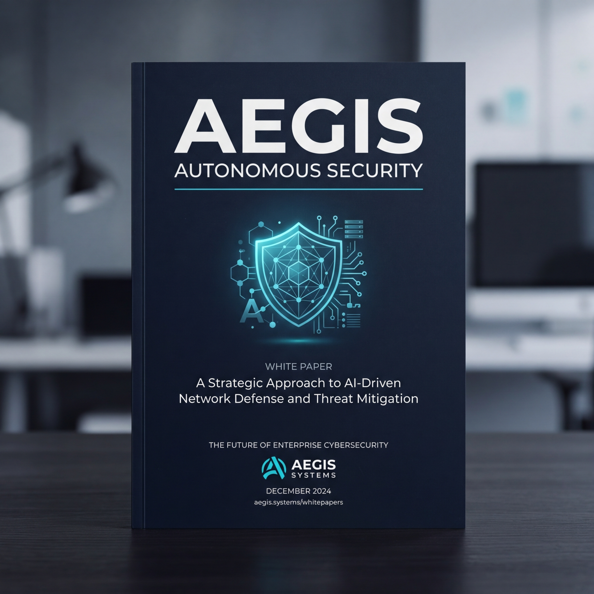
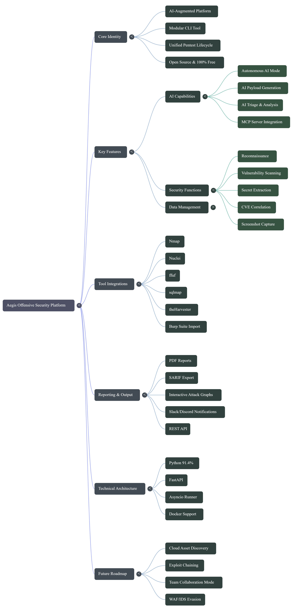
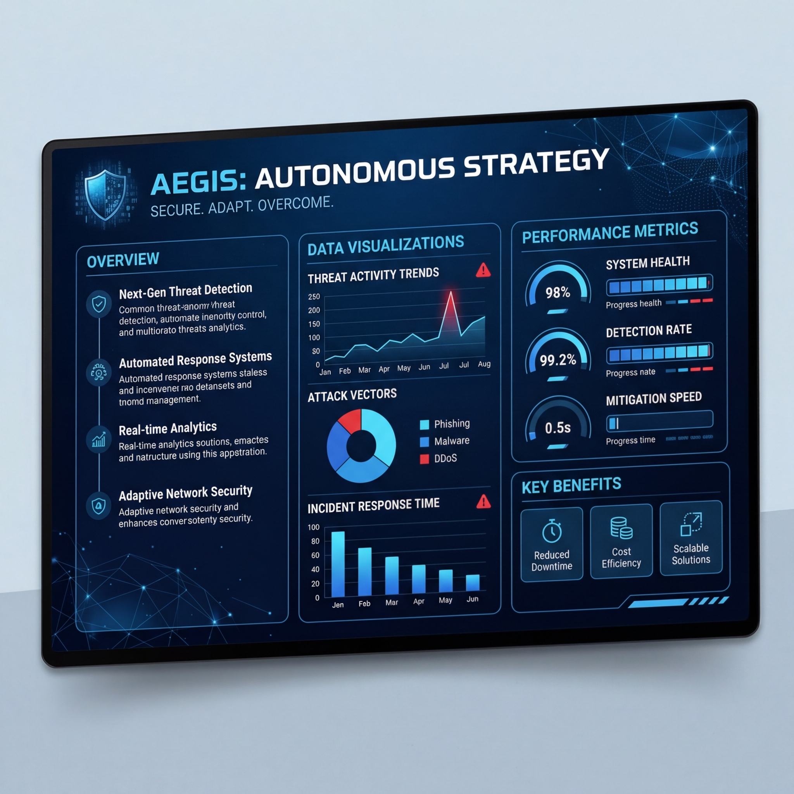

<p align="center">
  
</p>

<div align="center">

```
 █████╗ ███████╗ ██████╗ ██╗███████╗
██╔══██╗██╔════╝██╔════╝ ██║██╔════╝
███████║█████╗  ██║  ███╗██║███████╗
██╔══██║██╔══╝  ██║   ██║██║╚════██║
██║  ██║███████╗╚██████╔╝██║███████║
╚═╝  ╚═╝╚══════╝ ╚═════╝ ╚═╝╚══════╝
```

### AI-Augmented Offensive Security Platform

[](https://python.org)
[](LICENSE)
[](https://github.com/thecnical/aegis/actions)
[](https://mypy-lang.org)
[](https://github.com/astral-sh/ruff)
[](https://pypi.org/project/aegis-cli/)
[](https://github.com/PyCQA/bandit)
[](https://buymeacoffee.com/chandanpandit)

*One command. Every phase. Fully autonomous.*

> **Legal Notice:** Aegis is intended for authorized penetration testing and security research only.
> Using it against systems you do not own or have explicit written permission to test is illegal and unethical.

</div>

---

## Resources

### Architecture Mind Map

> Full attack-surface breakdown — every phase, every tool, every data flow — in one diagram.

<p align="center">
  
</p>

---

### Presentation & Whitepaper

<table align="center">
  <tr>
    <td align="center" width="50%">
      <a href="Aegis_Autonomous_Security.pdf">
        
      </a>
      <br/>
      <strong>📄 Whitepaper / PDF</strong><br/>
      <a href="Aegis_Autonomous_Security.pdf">View PDF →</a>
    </td>
    <td align="center" width="50%">
      <a href="Aegis_Autonomous_Security.pptx">
        
      </a>
      <br/>
      <strong>📊 Slide Deck / PPTX</strong><br/>
      <a href="Aegis_Autonomous_Security.pptx">Download Slides →</a>
    </td>
  </tr>
</table>

---

## Overview

**Aegis** is a modular, AI-driven penetration testing platform that unifies the complete offensive security lifecycle into a single CLI tool. Instead of managing a dozen separate tools with incompatible output formats, Aegis wraps them all — Nmap, Nuclei, ffuf, sqlmap, theHarvester, subfinder, and more — behind one consistent interface backed by a shared SQLite database, workspace isolation, and AI orchestration.

Every finding from every tool lands in the same database. Every scan runs inside a named workspace. Every result can be exported as a PDF report, a SARIF file for GitHub Code Scanning, or a JSON feed for CI/CD pipelines.

```bash
# Full autonomous pentest — recon, vuln scan, AI triage, report
aegis ai auto --target example.com --format html
```

### Who is it for?

| Audience | Use case |
|---|---|
| Penetration testers | Unified workflow — no more scattered terminal windows |
| Bug bounty hunters | Fast recon-to-report pipelines |
| Red teams | Parallel campaigns across many targets |
| Security engineers | Vulnerability scanning integrated into CI/CD |
| CTF players | AI-assisted attack surface analysis |

---

## Features

| Feature | Description |
|---|---|
| **Autonomous AI Mode** | `aegis ai auto` runs all phases end-to-end — recon, vuln scan, exploit suggestions, report |
| **AI Payload Generation** | After recon, AI generates targeted SQLi, XSS, SSRF, LFI, RCE payloads based on detected tech stack |
| **Secret Extraction** | `trufflehog` scans JS files, git repos, and local paths for exposed API keys and credentials |
| **Screenshot Capture** | `gowitness` auto-screenshots all discovered web services; images embedded in HTML reports |
| **Attack Path Graph** | Interactive D3.js force-directed graph in HTML reports — hosts, findings, severity chains |
| **MCP Server** | Exposes Aegis as an MCP tool server — Claude, Cursor, and other AI agents can drive pentests |
| **Burp Suite Import** | XXE-safe XML parsing, base64 request/response decoding, findings stored with full HTTP evidence |
| **CVE Correlation** | Queries NVD API v2, stores CVSS v3.1 scores and vectors per finding |
| **SARIF Export** | SARIF v2.1.0 with rule IDs, OWASP URIs, and GitHub security-severity scores |
| **Parallel Campaigns** | `asyncio`-based runner — each target gets its own session, results aggregated |
| **REST API** | FastAPI with async scan jobs, paginated findings, Burp import, SARIF download |
| **Workspace Isolation** | Each engagement has its own SQLite database — zero cross-engagement data leakage |
| **Scope Enforcement** | Every target is checked against scope before any tool runs; `safe_mode` aborts out-of-scope scans |
| **Deduplication** | SHA-256 fingerprint of `title+host+category` — duplicate findings are silently dropped |
| **Notifications** | Slack and Discord webhook delivery with per-severity filtering |
| **PDF Reports** | WeasyPrint renders HTML templates to PDF with severity filtering and custom branding |
| **100% Free** | No paid APIs required — all tools are open source |

---

## Strategic Vision

Aegis is built on a foundation of autonomous strategy and modular integration. The following Mind Map provides a comprehensive overview of the platform's core identity, key features, and future trajectory.

<p align="center">
  
</p>

---

## Documentation & Strategic Resources

Explore the theoretical and tactical foundations of Aegis through our dedicated security whitepaper and executive presentation.

<div align="center">

| **Autonomous Security Whitepaper** | **Executive Strategic Deck** |
|:---:|:---:|
| [](Aegis_Autonomous_Security.pdf) | [](Aegis_Autonomous_Security.pptx) |
| [📄 Download PDF](Aegis_Autonomous_Security.pdf) | [📊 Download PPTX](Aegis_Autonomous_Security.pptx) |

</div>

---

## Architecture

```
┌──────────────────────────────────────────────────────────────────┐
│  CLI Layer  (Click — main.py)                                    │
│  recon · vuln · exploit · ai · burp · cve · campaign · report   │
├──────────────────────────────────────────────────────────────────┤
│  Core Layer  (aegis/core/)                                       │
│  AIOrchestrator · CampaignRunner · BurpImporter                  │
│  CVECorrelator · SARIFExporter · TemplateManager · Notifier      │
├──────────────────────────────────────────────────────────────────┤
│  Tools Layer  (aegis/tools/)                                     │
│  recon/ · vuln/ · exploit/ · post/ · report/                     │
│  Each module is a Click command that writes findings to the DB   │
├──────────────────────────────────────────────────────────────────┤
│  Storage Layer  (SQLite per workspace)                           │
│  targets · hosts · ports · findings · evidence                   │
│  cve_correlations · scan_sessions · scope · api_tokens           │
└──────────────────────────────────────────────────────────────────┘
```

**Data flow:** tool runs → output parsed → `db.add_finding()` → AI triage → report generated → SARIF exported → CI/CD notified.

---

## Installation

### Option 1 — One-command installer (recommended)

Installs everything: apt packages, Go, Rust, subfinder, nuclei, trufflehog, gowitness, amass, feroxbuster, webtech, and Aegis itself.

```bash
git clone https://github.com/thecnical/aegis.git
cd aegis
sudo bash install.sh
```

Preview without making any changes:

```bash
sudo bash install.sh --dry-run
```

If Aegis is already installed, use the built-in bootstrap command:

```bash
sudo aegis bootstrap --yes

# Skip Rust/feroxbuster if you don't need it
sudo aegis bootstrap --yes --skip-rust

# Preview only
aegis bootstrap --dry-run
```

After install, open a new terminal:

```bash
aegis doctor                        # verify all tools are found
aegis ai auto --target example.com  # run your first pentest
```

---

### Option 2 — Manual install (Kali Linux)

**1. System dependencies**

```bash
sudo apt update
sudo apt install -y python3-pip python3-venv git \
  libpango-1.0-0 libpangoft2-1.0-0 libpangocairo-1.0-0 \
  libcairo2 libffi-dev libgdk-pixbuf-2.0-0
```

> The correct package name on modern Kali/Debian is `libgdk-pixbuf-2.0-0` — not `libgdk-pixbuf2.0-0`.

**2. Clone and create a virtual environment**

```bash
git clone https://github.com/thecnical/aegis.git
cd aegis
python3 -m venv .venv
source .venv/bin/activate
```

**3. Install Aegis**

```bash
pip install -e .
```

**4. Create directories and verify**

```bash
mkdir -p data/logs
aegis doctor
```

**5. Install external tools**

```bash
aegis install-tools --yes
```

---

### Option 3 — PyPI

```bash
pip install aegis-cli
pip install "aegis-cli[mcp]"   # include MCP server support
pip install -e ".[dev]"        # development dependencies
```

---

## Quick Start

```bash
# 1. Add a target to scope
aegis scope add example.com --kind domain

# 2. Run recon
aegis recon domain example.com

# 3. Scan for vulnerabilities
aegis vuln web https://example.com

# 4. Generate a report
aegis report generate example.com --format html

# 5. Or do all of the above in one command
aegis ai auto --target example.com --format html --full
```

---

## Configuration

All settings live in `config/config.yaml`. Aegis never reads environment variables for secrets.

```yaml
general:
  db_path: data/aegis.db
  safe_mode: true               # abort if target is out of scope
  wordlists_path: data/wordlists

api_keys:
  shodan: CHANGE_ME             # https://shodan.io (free tier available)
  openrouter: CHANGE_ME         # https://openrouter.ai (free tier available)
  bytez: CHANGE_ME              # https://bytez.com (free tier available)
  nvd: CHANGE_ME                # https://nvd.nist.gov/developers/request-an-api-key (free)

notifications:
  slack_webhook: ""
  discord_webhook: ""

profiles:
  default:
    timeout: 30
    nmap_args: "-sC -sV"
    nuclei_rate: 150
  stealth:
    timeout: 120
    nmap_args: "-sS -T2 --randomize-hosts"
    nuclei_rate: 20
  deep:
    timeout: 90
    nmap_args: "-sC -sV -A -O --script=vuln"
    nuclei_rate: 50
```

Switch profiles with `--profile stealth`. All API keys have free tiers — no paid subscriptions required.

**Global CLI flags:**

| Flag | Default | Description |
|---|---|---|
| `--config PATH` | `config/config.yaml` | Config file path |
| `--profile NAME` | `default` | Scan profile |
| `--workspace NAME` | active workspace | Override active workspace |
| `--json` | off | Output as JSON |
| `--json-output FILE` | — | Write JSON to file |
| `--debug` | off | Enable debug logging |

---

## Workspaces

Each engagement gets its own isolated SQLite database. No shared state between workspaces.

```bash
aegis workspace create client-acme     # create a new workspace
aegis workspace switch client-acme     # switch to it
aegis workspace list                   # list all workspaces
aegis workspace delete old-engagement  # remove a workspace

# Override for a single command without switching
aegis --workspace client-acme recon domain acme.com
```

---

## Scope Management

Before any tool runs, `ScopeManager` checks whether the target is in scope. With `safe_mode: true`, out-of-scope scans abort before any network request is made.

```bash
aegis scope add acme.com --kind domain
aegis scope add 10.10.0.0/16 --kind cidr
aegis scope add https://api.acme.com --kind url
aegis scope add 192.168.1.5 --kind ip

aegis scope list
aegis scope remove 3
```

---

## Recon

```bash
# Subdomain enumeration, DNS, Nmap on discovered hosts
aegis recon domain example.com

# CIDR range scan — hosts, ports, services
aegis recon network 192.168.1.0/24 --port-scan

# DNS record queries
aegis recon dns example.com --types A,MX,TXT,NS,AAAA

# OSINT — emails, GitHub dorks, Shodan
aegis recon osint example.com --emails --github-dorks

# Secret scanning (trufflehog)
aegis recon secrets /path/to/project
aegis recon secrets https://github.com/target/repo --mode git

# Screenshot all web services (gowitness)
aegis recon screenshot example.com
aegis recon screenshot . --from-db
```

---

## Vulnerability Scanning

```bash
# Web vuln scan via Nuclei templates
aegis vuln web https://example.com

# Network vuln scan via Nmap NSE scripts
aegis vuln net 192.168.1.1

# SSL/TLS analysis via testssl.sh
aegis vuln ssl example.com --port 443

# API fuzzing via ffuf
aegis vuln api https://api.example.com --wordlist data/wordlists/api.txt
```

---

## Technology Detection

Aegis uses free, open-source tools — no paid API key required.

| Tool | Install | Notes |
|---|---|---|
| **webtech** | `pip install webtech` | Fingerprints via headers, HTML, cookies |
| **whatweb** | `sudo apt install whatweb` | Pre-installed on Kali Linux |

Aegis tries `webtech` first, falls back to `whatweb` automatically.

```bash
aegis recon domain example.com              # tech detection runs automatically
aegis recon domain example.com --no-techdetect  # skip if not needed
```

---

## AI Features

### Autonomous Mode

```bash
# Full pentest — recon, vuln, AI triage, report
aegis ai auto --target example.com

# All 5 phases + HTML report
aegis ai auto --target example.com --full --format html

# Dry run — see what would run without executing
aegis ai auto --target example.com --dry-run
```

### AI Triage and Analysis

```bash
aegis ai triage --session 1        # triage findings from a session
aegis ai summarize --session 1     # executive summary
aegis ai suggest --target acme.com # attack surface suggestions
aegis ai report --target acme.com  # generate narrative report section
aegis ai chat                      # interactive AI chat about findings
```

### AI Payload Generation

During `aegis ai auto`, after recon completes, the AI automatically generates targeted payloads (SQLi, XSS, SSRF, LFI, RCE) based on the detected tech stack. Payloads are stored as `medium` severity findings with category `ai-payload`. Uses your free OpenRouter or Bytez key.

---

## MCP Server — AI Agent Integration

Aegis can run as an [MCP](https://modelcontextprotocol.io) server, letting AI agents like Claude or Cursor drive full pentests autonomously.

```bash
pip install mcp
aegis-mcp
```

Add to your Claude / Cursor MCP config:

```json
{
  "mcpServers": {
    "aegis": {
      "command": "python",
      "args": ["-m", "aegis.mcp_server"]
    }
  }
}
```

Available MCP tools:

| Tool | Description |
|---|---|
| `aegis_recon_domain` | Subdomain enum + tech detection |
| `aegis_vuln_web` | Nuclei web vulnerability scan |
| `aegis_ai_auto` | Full autonomous pentest |
| `aegis_get_findings` | Query findings from the database |
| `aegis_generate_report` | Generate a report |
| `aegis_scope_add` | Add a target to scope |
| `aegis_secrets_scan` | Scan for exposed secrets |

---

## Reports

```bash
# Markdown report
aegis report generate example.com --format md

# HTML report with D3.js attack path graph
aegis report generate example.com --format html

# PDF report
aegis report generate example.com --format pdf

# Filter by minimum severity
aegis report generate example.com --format html --min-severity high
```

HTML reports include an interactive D3.js force-directed attack path graph — blue nodes for hosts, colored nodes for findings by severity, edges showing relationships.

---

## Burp Suite Integration

```bash
# Import findings from a Burp XML export
aegis burp import scan.xml

# Preview without importing
aegis burp import scan.xml --dry-run

# List all Burp-imported findings
aegis burp list
```

---

## CVE Correlation

```bash
# Correlate all findings in a session with NVD CVEs
aegis cve correlate --session 1

# Search NVD directly
aegis cve search "apache log4j" --max 10

# List CVEs linked to a specific finding
aegis cve list --finding 42
```

---

## Campaigns

Run parallel scans across multiple targets and track results over time.

```bash
# Create a campaign
aegis campaign create q4-audit --domain acme.com

# Run it
aegis campaign run q4-audit --full

# Run against a list of targets in parallel
aegis campaign run-parallel q4-audit --targets targets.txt --max-parallel 5

# Compare two runs
aegis campaign diff q4-audit

# Generate a campaign report
aegis campaign report q4-audit
```

---

## Notifications

```bash
# Send a test notification
aegis notify test --channel slack

# Send findings from a session
aegis notify send --session 1 --min-severity high --channel discord
```

Configure webhooks in `config/config.yaml`:

```yaml
notifications:
  slack_webhook: "https://hooks.slack.com/services/..."
  discord_webhook: "https://discord.com/api/webhooks/..."
```

---

## SARIF Export

```bash
# Export all findings as SARIF v2.1.0
aegis sarif export

# Export a specific session
aegis sarif export --session 1 --output results.sarif
```

Upload to GitHub Code Scanning via the `github/codeql-action/upload-sarif` action for inline PR annotations.

---

## Uninstall

```bash
aegis uninstall --dry-run                              # preview only
aegis uninstall --yes                                  # remove Aegis and tools
aegis uninstall --yes --remove-data                    # also delete databases and reports
aegis uninstall --yes --remove-data --remove-config    # full clean
```

---

## Development

```bash
git clone https://github.com/thecnical/aegis.git
cd aegis
python3 -m venv .venv && source .venv/bin/activate
pip install -e ".[dev]"

pytest --tb=short          # run tests
ruff check .               # lint
mypy aegis/                # type check
```

---

## Roadmap

**Near-term**
- HTTP request smuggling detection (`smuggler` / `h2csmuggler` integration)
- Cloud asset discovery — S3 buckets, Azure blobs, GCP storage enumeration
- Passive JS endpoint extraction during recon

**Medium-term**
- Autonomous exploit chaining — AI selects and chains exploits based on confirmed vulns
- Team collaboration mode — shared workspace over PostgreSQL
- Custom Nuclei template generation — AI writes YAML templates for discovered endpoints

**Research-grade**
- Protocol-level fuzzing with `boofuzz` and finding correlation
- WAF/IDS evasion using AI-generated obfuscated payloads
- CVE-to-PoC auto-mapping — correlate NVD CVEs with ExploitDB and GitHub PoCs

---

## Contributing

Pull requests are welcome. For major changes, open an issue first.

Please ensure `ruff check .` and `mypy aegis/` pass before submitting a PR.

---

## Support

If Aegis saves you time on an engagement or helps you learn offensive security, consider supporting the project.

[](https://buymeacoffee.com/chandanpandit)

---

## License

MIT — see [LICENSE](LICENSE) for details.
